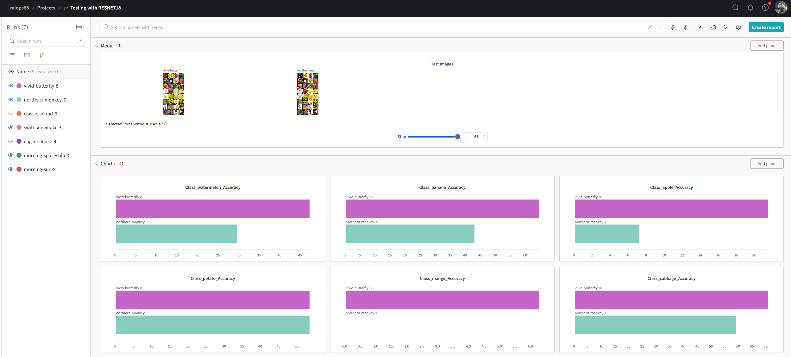
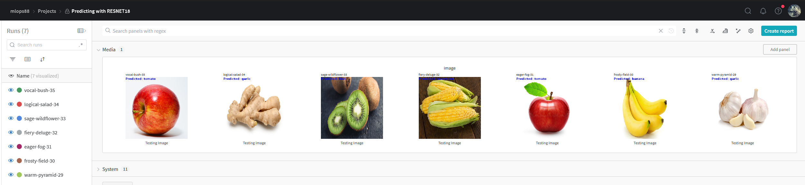
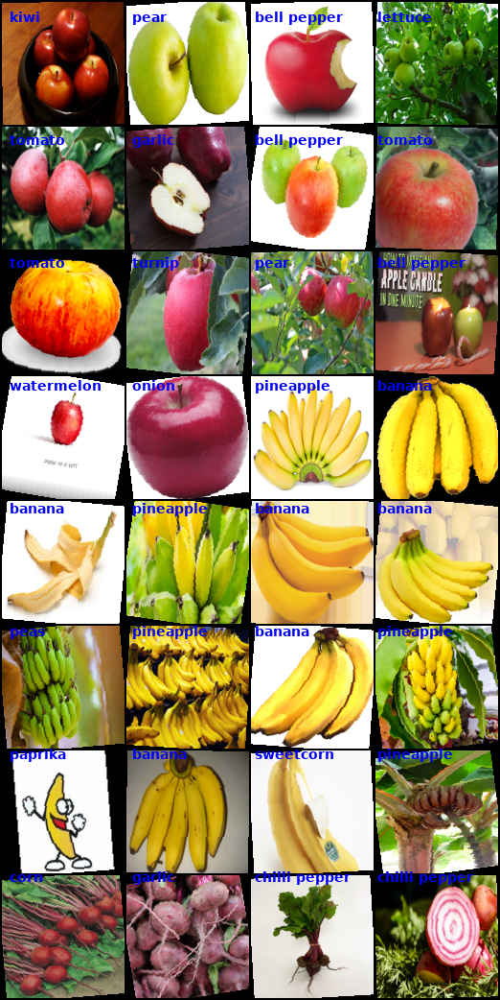
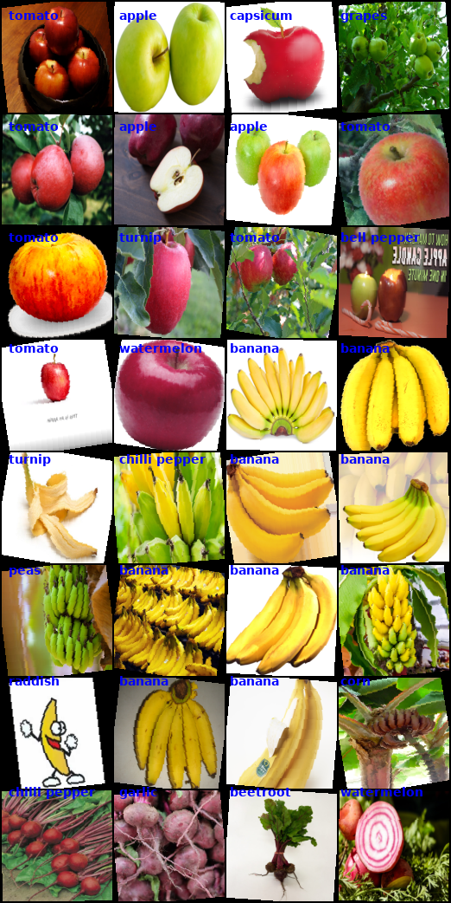

# Exam template for 02476 Machine Learning Operations

## Overall project checklist

The checklist is _exhaustic_ which means that it includes everything that you could possible do on the project in
relation the curricilum in this course. Therefore, we do not expect at all that you have checked of all boxes at the
end of the project.

### Week 1

- [x] Create a git repository
- [x] Make sure that all team members have write access to the github repository
- [x] Create a dedicated environment for you project to keep track of your packages
- [x] Create the initial file structure using cookiecutter
- [x] Fill out the `make_dataset.py` file such that it downloads whatever data you need and
- [x] Add a model file and a training script and get that running
- [x] Remember to fill out the `requirements.txt` file with whatever dependencies that you are using
- [x] Remember to comply with good coding practices (`pep8`) while doing the project
- [x] Do a bit of code typing and remember to document essential parts of your code
- [x] Setup version control for your data or part of your data
- [x] Construct one or multiple docker files for your code
- [x] Build the docker files locally and make sure they work as intended
- [x] Write one or multiple configurations files for your experiments
- [x] Used Hydra to load the configurations and manage your hyperparameters
- [x] When you have something that works somewhat, remember at some point to to some profiling and see if
      you can optimize your code
- [x] Use Weights & Biases to log training progress and other important metrics/artifacts in your code. Additionally,
      consider running a hyperparameter optimization sweep.
- [x] Use Pytorch-lightning (if applicable) to reduce the amount of boilerplate in your code

### Week 2

- [x] Write unit tests related to the data part of your code
- [x] Write unit tests related to model construction and or model training
- [x] Calculate the coverage.
- [x] Get some continuous integration running on the github repository
- [x] Create a data storage in GCP Bucket for you data and preferable link this with your data version control setup
- [x] Create a trigger workflow for automatically building your docker images
- [x] Get your model training in GCP using either the Engine or Vertex AI
- [ ] Create a FastAPI application that can do inference using your model
- [ ] If applicable, consider deploying the model locally using torchserve
- [x] Deploy your model in GCP using either Functions or Run as the backend

### Week 3

- [ ] Check how robust your model is towards data drifting
- [ ] Setup monitoring for the system telemetry of your deployed model
- [ ] Setup monitoring for the performance of your deployed model
- [ ] If applicable, play around with distributed data loading
- [ ] If applicable, play around with distributed model training
- [ ] Play around with quantization, compilation and pruning for you trained models to increase inference speed

### Additional

- [ ] Revisit your initial project description. Did the project turn out as you wanted?
- [ ] Make sure all group members have a understanding about all parts of the project
- [ ] Uploaded all your code to github

## Group information

### Question 1

> **Enter the group number you signed up on <learn.inside.dtu.dk>**
>
> Answer:

Group 88

### Question 2

> **Enter the study number for each member in the group**
>
> Answer:

s184846, s170894, s240444

### Question 3

> **What framework did you choose to work with and did it help you complete the project?**
>
> Answer length: 100-200 words.
>
> Example:
> _We used the third-party framework ... in our project. We used functionality ... and functionality ... from the_ > _package to do ... and ... in our project_.
>
> Answer:

At the project's beginning, our primary exploration centered on PyTorch imaging models (timm), with an initial intent to exclusively leverage their capabilities. However, as the project advanced, the incorporation of PyTorch Lightning became integral due to its remarkable capacity to significantly trim down residual lines of code. Our resultant model is now a balanced blend of the potent PyTorch imaging models and the efficiency-driven PyTorch Lightning framework.

The selection of timm was particularly fitting, given our specific focus on classification tasks. The extensive model zoo offered by timm, including models like ResNet18, seamlessly aligned with our project goals. This strategy streamlined our development process but also heightened the adaptability and effectiveness of creating a model that can do classification.

## Coding environment

> In the following section we are interested in learning more about you local development environment.

### Question 4

> **Explain how you managed dependencies in your project? Explain the process a new team member would have to go** > **through to get an exact copy of your environment.**
>
> Answer length: 100-200 words
>
> Example:
> _We used ... for managing our dependencies. The list of dependencies was auto-generated using ... . To get a_ > _complete copy of our development environment, one would have to run the following commands_
>
> Answer:

We employed a combination of conda, requirements.txt, and Docker containers to effectively manage dependencies in our project. Our dependency list was automatically generated using conda and captured in the requirements.txt file. To replicate our development environment precisely, a new team member would need to run the following commands:

```
conda create --name <env_name> python=3.11
conda activate <env_name>
pip install -r requirements.txt
```

Also we used docker containers for further encapsulations with the commands:

```
docker build -t <image_name> .
docker run -it <image_name>
```

where the image_name is in our dockerfiles directory for prediction and training our model.

### Question 5

> **We expect that you initialized your project using the cookiecutter template. Explain the overall structure of your** > **code. Did you fill out every folder or only a subset?**
>
> Answer length: 100-200 words
>
> Example:
> _From the cookiecutter template we have filled out the ... , ... and ... folder. We have removed the ... folder_ > _because we did not use any ... in our project. We have added an ... folder that contains ... for running our_ > _experiments._
> Answer:

Our project was initialized using a custom Cookiecutter template crafted by Nicki for the course, providing a well-structured foundation. The project structure proved intuitive, leading to seamless integration of essential components. Notably, we introduced scripts for model operations, dataset creation, and prediction/training. DVC (Data Version Control) played a pivotal role in managing our data, with datasets conveniently fetched into the 'data' directory.

To enhance project clarity and reproducibility, added a copy of the README file from the `dtu_mlops` report directory into our own. This file not only tracks project progress but also serves as a valuable resource for addressing exam questions. Additionally, we established a `conf` directory housing configuration files. These files are instrumental for configuring experiments, ensuring consistency and ease when conducting model predictions or training. Overall, our project structure, enriched with these components, fosters a cohesive and organized workflow.

### Question 6

> **Did you implement any rules for code quality and format? Additionally, explain with your own words why these** > **concepts matters in larger projects.**
>
> Answer length: 50-100 words.
>
> Answer:

We use cookiecutter to keep our code and directory structured and standardized. Code quality and format are crucial in large projects because they ensure maintainability, readability, and consistency. High-quality code with a standardized format facilitates easier understanding and navigation for developers, enabling efficient collaboration and debugging. This is especially important in large projects where multiple teams or individuals contribute to the codebase over time. It reduces the risk of errors and potential technical debt by enforcing best practices and coding standards.

## Version control

> In the following section we are interested in how version control was used in your project during development to
> corporate and increase the quality of your code.

### Question 7

> **How many tests did you implement and what are they testing in your code?**
>
> Answer length: 50-100 words.
>
> Example:
> _In total we have implemented X tests. Primarily we are testing ... and ... as these the most critical parts of our_ > _application but also ... ._
>
> Answer:

Test_dvc : It checks whether dvc has been installed or not.
Test_model: This test checks that the forward method of MyTimmNet produces an output tensor with the correct shape given a batch of input images. The test uses a pytest fixture to create an instance of MyTimmNet that can be reused in multiple tests if needed.

### Question 8

> **What is the total code coverage (in percentage) of your code? If you code had an code coverage of 100% (or close** > **to), would you still trust it to be error free? Explain you reasoning.**
>
> Answer length: 100-200 words.
>
> Example:
> *The total code coverage of code is X%, which includes all our source code. We are far from 100% coverage of our \*\* > *code and even if we were then...\*
>
> Answer:

Our overall coverage including the two tests is 40%. No, I would not completely trust 100% coverage to be absolutely error free. There can always be some edge cases that the unit tests do not account for, or there could be a logical flaw in the tests themselves. Coverage only tells us that the lines of code were executed, but not about the assertions. So we can have tests that execute all the code but don't check the results properly. Also, high coverage with low code quality can give a false sense of security.

### Question 9

> **Did you workflow include using branches and pull requests? If yes, explain how. If not, explain how branches and** > **pull request can help improve version control.**
>
> Answer length: 100-200 words.
>
> Example:
> _We made use of both branches and PRs in our project. In our group, each member had an branch that they worked on in_ > _addition to the main branch. To merge code we ..._
>
> Answer:

Yes, our workflow embraced branches and pull requests. With three team members, we each worked on separate branches for tasks and created new ones for new issues, closing old branches once merged. This allowed parallel work without conflicts.

For task management, we assigned a dedicated branch, and after completion, a pull request was initiated, summarizing changes for collaborative review. This process ensured code quality before merging into the main branch. The systematic use of branches and pull requests improved code organization, reduced conflicts, and provided a clear version history. This approach significantly enhanced our version control, and gave us a more efficient and collaborative development process.

### Question 10

> **Did you use DVC for managing data in your project? If yes, then how did it improve your project to have version** > **control of your data. If no, explain a case where it would be beneficial to have version control of your data.**
>
> Answer length: 100-200 words.
>
> Example:
> _We did make use of DVC in the following way: ... . In the end it helped us in ... for controlling ... part of our_ > _pipeline_
>
> Answer:

Initially we used DVC with google drive for managing our project's data. However when there is a need for more advanced capabilities and scalability, is it better to use something cloud based. We therefore transitioned to Google Cloud Platform (GCP). Moving to GCP enhances data storage and processing capabilities, allowing to efficiently handle larger datasets and scale our project if needed. GCP's infrastructure can provide better performance and reliability for data intensive tasks and off-load our computer/laptops. The integration of DVC with google drive were a lot easier than integrating GCP. Though when GCP is set up correctly it is a lot better i.e. you don’t have to download the whole dataset every time to run the code etc. The shift from google drive to GCP, while using DVC would be “necessary” in the long run for better scaling and performance.

### Question 11

> **Discuss you continues integration setup. What kind of CI are you running (unittesting, linting, etc.)? Do you test** > **multiple operating systems, python version etc. Do you make use of caching? Feel free to insert a link to one of** > **your github actions workflow.**
>
> Answer length: 200-300 words.
>
> Example:
> _We have organized our CI into 3 separate files: one for doing ..., one for running ... testing and one for running_ > _... . In particular for our ..., we used ... .An example of a triggered workflow can be seen here: <weblink>_
>
> Answer:

Our CI is based on GitHub actions. It is triggered to run when code is pushed to the master, main, or dev/devansh branches, and when a pull request is made to the master or main branches. It was tested with windows-latest and ubuntu-latest and it contains a single job ‘build’.
It uses the checkout@v2 action to access the repository’s code. It sets up python 3.10.10 and installs all dependencies mentioned in the requirements.txt file using pip. Then we install pytest and run pytest -v to check if the installation is proper so far. In the final step, we execute the unit tests that are located in the tests/ folder using pytest. This workflow ensures that every push to the specified branches or pull request to master will trigger an automated process to build the environment and run tests, helping maintain code quality and reliability.

## Running code and tracking experiments

> In the following section we are interested in learning more about the experimental setup for running your code and
> especially the reproducibility of your experiments.

### Question 12

> **How did you configure experiments? Did you make use of config files? Explain with coding examples of how you would** > **run a experiment.**
>
> Answer length: 50-100 words.
>
> Example:
> _We used a simple argparser, that worked in the following way: python my_script.py --lr 1e-3 --batch_size 25_
>
> Answer:

We created a directory `conf` that contains the configuration files for training/predicting and used Hydra to load them into our model.

config_train:

```yaml
models:
  name: resnet18
paths:
  all_images: "${hydra:runtime.cwd}/data/raw/all_image_data"
params:
  epoch_count: 10
  lr: 1e-3
  batch_size: 32
```

config_test:

```yaml
models:
  name: resnet18
paths:
  checkpoint_path: "${hydra:runtime.cwd}/lightning_logs/version_17/checkpoints/epoch=4-step=370.ckpt"
  all_images: "${hydra:runtime.cwd}/data/raw/all_image_data"
  testing_image: "${hydra:runtime.cwd}/data/Red_Apple.jpg"
```

Where we define the hyperparameters and paths that are then parsed all the way down in the stream. For the training config the important thing is to have a correct path that points to the image data that we are using. As for the test we are loading a checkpoint in and set the model in evaluation mode where then we can test it with an image that the `testing_image` variable is pointing to.

### Question 13

> **Reproducibility of experiments are important. Related to the last question, how did you secure that no information** > **is lost when running experiments and that your experiments are reproducible?**
>
> Answer length: 100-200 words.
>
> Example:
> _We made use of config files. Whenever an experiment is run the following happens: ... . To reproduce an experiment_ > _one would have to do ..._
>
> Answer:

To ensure robust reproducibility, we implemented Weights and Biases to log and track critical information. Leveraging the seamless integration of PyTorch Lightning with WandB, we effortlessly monitored data and checkpoints, enabling the resumption of experiments and the exploration of various parameters. The synergy between PyTorch Lightning and wandb streamlined our workflow, fostering a more iterative and insightful approach to model development.

Furthermore, the configuration files mentioned earlier played a pivotal role in enhancing flexibility. By adopting an abstract structure facilitated by Hydra, we easily created multiple configuration files. This abstraction allows us to conduct tests with diverse model configurations. Adjusting the configuration file loaded by Hydra becomes the sole requirement to experiment with different setups, providing a straightforward means of testing and optimizing our model under various conditions. This cohesive integration of tools and practices establishes a robust foundation for reproducibility and experimentation in our project.

### Question 14

> **Upload 1 to 3 screenshots that show the experiments that you have done in W&B (or another experiment tracking** > **service of your choice). This may include loss graphs, logged images, hyperparameter sweeps etc. You can take** > **inspiration from [this figure](figures/wandb.png). Explain what metrics you are tracking and why they are** > **important.**
>
> Answer length: 200-300 words + 1 to 3 screenshots.
>
> Example:
> _As seen in the first image when have tracked ... and ... which both inform us about ... in our experiments._ > _As seen in the second image we are also tracking ... and ..._
>
> Answer:

<div style="text-align: center;">
  
  
</div>

We tracked the models accurcy for each of the classes as well as an image of the last testing batch, where the models prediction is written on each testing image. Such we can easly see how well the model is performing and how they differ from one another. In the first image we are looking at 2 different runs the light blue and purple. The second screenshot shows the output whenever we are running our `predict_model.py`, we are tracking the output image with the models prediction written into the image such that we can test with different images from the internet that the model have yet seen.

What is interesting is that if we look at the first screeenshot the purple run is performing much better at classifing apples. If we inspect their output:

<p style="text-align: center;">
  
  
</p>

The left image is the light blue run and the right image is the purple run. Here you can see that our model is doing a much better job at classifying apples in the purple compared to the light blue run. This can also be seen in the graphs.

### Question 15

> **Docker is an important tool for creating containerized applications. Explain how you used docker in your** > **experiments? Include how you would run your docker images and include a link to one of your docker files.**
>
> Answer length: 100-200 words.
>
> Example:
> _For our project we developed several images: one for training, inference and deployment. For example to run the_ > _training docker image: `docker run trainer:latest lr=1e-3 batch_size=64`. Link to docker file: <weblink>_
>
> Answer:

We used docker to package our applications making them easy to run in any environment. The cloudbuild.yaml file shows how we built and shared our applications using google cloud build. We had two dockerfiles, one for the prediction model (predict_model.dockerfile) and another for the training model (train_model.dockerfile). They each build an image with everything needed for predictions or training. Both files included instructions on what to do when run. We had some issues using commands such as “docker run” etc. due to docker deamon not running and used a lot of time trying to fix this error.
Here is a link for the dockerfiles:

https://console.cloud.google.com/gcr/images/dtumlops-411611?referrer=search&project=dtumlops-411611

### Question 16

> **When running into bugs while trying to run your experiments, how did you perform debugging? Additionally, did you** > **try to profile your code or do you think it is already perfect?**
>
> Answer length: 100-200 words.
>
> Example:
> _Debugging method was dependent on group member. Some just used ... and others used ... . We did a single profiling_ > _run of our main code at some point that showed ..._
>
> Answer:

--- question 16 fill here ---

## Working in the cloud

> In the following section we would like to know more about your experience when developing in the cloud.

### Question 17

> **List all the GCP services that you made use of in your project and shortly explain what each service does?**
>
> Answer length: 50-200 words.
>
> Example:
> _We used the following two services: Engine and Bucket. Engine is used for... and Bucket is used for..._
>
> Answer:

--- question 17 fill here ---

### Question 18

> **The backbone of GCP is the Compute engine. Explained how you made use of this service and what type of VMs** > **you used?**
>
> Answer length: 100-200 words.
>
> Example:
> _We used the compute engine to run our ... . We used instances with the following hardware: ... and we started the_ > _using a custom container: ..._
>
> Answer:

--- question 18 fill here ---

### Question 19

> **Insert 1-2 images of your GCP bucket, such that we can see what data you have stored in it.** > **You can take inspiration from [this figure](figures/bucket.png).**
>
> Answer:

--- question 19 fill here ---

### Question 20

> **Upload one image of your GCP container registry, such that we can see the different images that you have stored.** > **You can take inspiration from [this figure](figures/registry.png).**
>
> Answer:

--- question 20 fill here ---

### Question 21

> **Upload one image of your GCP cloud build history, so we can see the history of the images that have been build in** > **your project. You can take inspiration from [this figure](figures/build.png).**
>
> Answer:

--- question 21 fill here ---

### Question 22

> **Did you manage to deploy your model, either in locally or cloud? If not, describe why. If yes, describe how and** > **preferably how you invoke your deployed service?**
>
> Answer length: 100-200 words.
>
> Example:
> _For deployment we wrapped our model into application using ... . We first tried locally serving the model, which_ > _worked. Afterwards we deployed it in the cloud, using ... . To invoke the service an user would call_ > _`curl -X POST -F "file=@file.json"<weburl>`_
>
> Answer:

--- question 22 fill here ---

### Question 23

> **Did you manage to implement monitoring of your deployed model? If yes, explain how it works. If not, explain how** > **monitoring would help the longevity of your application.**
>
> Answer length: 100-200 words.
>
> Example:
> _We did not manage to implement monitoring. We would like to have monitoring implemented such that over time we could_ > _measure ... and ... that would inform us about this ... behaviour of our application._
>
> Answer:

--- question 23 fill here ---

### Question 24

> **How many credits did you end up using during the project and what service was most expensive?**
>
> Answer length: 25-100 words.
>
> Example:
> _Group member 1 used ..., Group member 2 used ..., in total ... credits was spend during development. The service_ > _costing the most was ... due to ..._
>
> Answer:

--- question 24 fill here ---

## Overall discussion of project

> In the following section we would like you to think about the general structure of your project.

### Question 25

> **Include a figure that describes the overall architecture of your system and what services that you make use of.** > **You can take inspiration from [this figure](figures/overview.png). Additionally in your own words, explain the** > **overall steps in figure.**
>
> Answer length: 200-400 words
>
> Example:
>
> _The starting point of the diagram is our local setup, where we integrated ... and ... and ... into our code._ > _Whenever we commit code and puch to github, it auto triggers ... and ... . From there the diagram shows ..._
>
> Answer:

--- question 25 fill here ---

### Question 26

> **Discuss the overall struggles of the project. Where did you spend most time and what did you do to overcome these** > **challenges?**
>
> Answer length: 200-400 words.
>
> Example:
> _The biggest challenges in the project was using ... tool to do ... . The reason for this was ..._
>
> Answer:

Dividing the project among team members initially posed a challenge due to the absence of a holistic overview. Nicki's checklist emerged as a valuable resource, offering a structured approach. While we dedicated significant time to model development, the introduction of PyTorch Lightning proved to be a game-changer. This framework not only facilitated the refinement of our model through several iterations but also expedited the overall development process. Its clarity and efficiency were particularly noteworthy, helping us navigate the complexities more effectively.

Despite these successes, challenges arose, especially in the realm of Google Cloud Platform (GCP). Difficulties encountered in configuring GCP settings and addressing infrastructure-related issues meant that certain planned tasks, such as creating an API to interact with our model, were deferred.

Collaboration presented its own set of hurdles, notably due to team members coming from different educational backgrounds. The collaboration between the two DTU students benefitted from aligned timelines, with a shared three-week course schedule allowing for more seamless teamwork. However, coordinating with the EuroTEQ student proved challenging as he taking multiple courses concurrently. Navigating these differences underscored the importance of effective communication and flexible collaboration strategies when dealing with diverse team compositions and varying external commitments.

In retrospect, the project's challenges provided valuable insights into project management dynamics, emphasizing the need for a comprehensive understanding of the project landscape and clear communication channels. While the difficulties with GCP and team collaboration were indeed setbacks, they also prompted adaptive strategies and enhanced our problem-solving skills. Moving forward, these experiences will undoubtedly contribute to more streamlined processes and improved collaboration in future projects.

### Question 27

> **State the individual contributions of each team member. This is required information from DTU, because we need to** > **make sure all members contributed actively to the project**
>
> Answer length: 50-200 words.
>
> Example:
> _Student sXXXXXX was in charge of developing of setting up the initial cookie cutter project and developing of the_ > _docker containers for training our applications._ > _Student sXXXXXX was in charge of training our models in the cloud and deploying them afterwards._ > _All members contributed to code by..._
>
> Answer:

s184846 was in charge of setting up the repo with cookie cutter and develop a model with timm aswell as with pytorch lightning. Furthermore, setting up the configurations with Hydra and logging information with Weights and Baises.

s170894 was in charge of the implementing DVC aswell as the requirements and containerizing our project into dockers. He was also responsible for setting up our GCP and deploy the model in the cloud such that we could cover that aspect of the course.

s240444 was in charge of the CI part where he was resposible for setting up unit testing for our model aswell as looking into github runners to automate some of these tasks.
